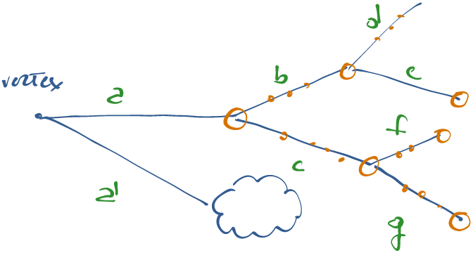

# Introduction {#intro}

## Definitions {#defs}

Let's first start defining few objects that will be used over and over again.

* **SimTrack**: a
  [`SimTrack`](https://github.com/cms-sw/cmssw/blob/master/SimDataFormats/Track/interface/SimTrack.h)
  is a track that has been produced by **Geant4**, i.e. this track can be a
  product of the interaction with the detector.
* **GenParticle** : a
  [`GenParticle`](https://github.com/cms-sw/cmssw/blob/master/DataFormats/HepMCCandidate/interface/GenParticle.h)
  is a track that has been produced by **Pythia**, i.e. this track is usually
  the product of the initial p-p collision and cannot come from the _downstream_
  detector simulation.

> **[info] Info**
> Not all **SimTracks** are **GenParticles** (the ones coming from decays and
from the interaction with the detector), but usually all the **GenParticles**
(within the detector acceptance) are **SimTracks**. The **CaloParticles** are
connected with **both** worlds.

## General Information {#general}

* A CaloParticles is created from a SimTrack (usually the one _closer_ to the
production vertex): all the physical parameters of the CaloParticle will be
inherited from the SimTrack.
* The CaloParticles, though, stores also all the information coming from all the
SimHits coming from all other SimTracks that are children of the original
SimTrack, together with the SimHits that it itself has left into the
calorimeter.

# Software Implementation {#implementation}

The package that creates the CaloParticle is
[`CaloTruthAccumulator`](https://github.com/cms-sw/cmssw/blob/master/SimGeneral/CaloAnalysis/plugins/CaloTruthAccumulator.cc).
The code itself is pretty well documented. It internally exploits a **graph**,
since this describes pretty well the nature of particle decays.

## The Graph {#graph}

The graph represents the full decay chain.  The parent-child relationship is the
natural one, following "time".  Each edge has a property (`edge_weight_t`) that
holds a const pointer to the `SimTrack` that connects the 2 vertices of the
edge, the number of `SimHits` associated to that `SimTrack` and the cumulative
number of `SimHits` of itself and of all its children. Only `SimHits` within the
selected detectors are taken into account. The cumulative property is filled
during the *depth first search* (**dfs**) exploration of the graph: if not
explored the number is 0.  Each vertex has a property (`vertex_name_t`) that holds
a const pointer to the `SimTrack` that originated that vertex and the cumulative
number of `SimHits` of all its outgoing edges. The cumulative property is filled
during the **dfs** exploration of the graph: if not explored the number is 0.
Stable particles are recovered/added in a second iterations and are linked to
ghost vertices with an offset starting from the highest generated vertex.
Multiple decays of a single particle that retains its original trackId are
merged into one unique vertex (the first encountered) in order to avoid multiple
counting of its associated `SimHits` (if any).

Further implementation details are explained directly in the code.

## Products {#products}

The products put into the event are mainly 2 (3 if we consider the pre-mixing
development): a `SimClusterCollection` and a `CaloParticleCollection`. Both
collections are `std::vector` of the corresponding objects: `SimCluster` and
`CaloParticle`, respectively. The corresponding python product label is
`MergedCaloTruth`.

### SimCluster {#simcluster}

A
[`SimCluster`](https://github.com/cms-sw/cmssw/blob/master/SimDataFormats/CaloAnalysis/interface/SimCluster.h)
has internally the following private members:

```c++
uint64_t nsimhits_;
EncodedEventId event_;

uint32_t particleId_;
float simhit_energy_;
std::vector<uint32_t> hits_;
std::vector<float> fractions_;

math::XYZTLorentzVectorF theMomentum_;

/// references to G4 and reco::GenParticle tracks
std::vector<SimTrack> g4Tracks_;
reco::GenParticleRefVector genParticles_;
```

A `SimCluster` is constructed starting from a single `SimTrack`. Afterwords,
many other `SimTracks` (and `GenParticles`) can be potentially added to the
`SimCluster` using the appropriate `add*` methods. Hence, a `SimCluster` is a
collection of `GenParticles` and `SimTracks`.

> **[warning] Warning**
> This statement will be explained better in later section, since the plural
here, is the concept itself of **collection**,  really does not hold!

<br/>

> **[danger] Danger**
> Its physical properties are derived for the `SimTrack` used to create
the `SimCluster` in the first place.


### CaloParticle {#caloparticle}

A
[`CaloParticle`](https://github.com/cms-sw/cmssw/blob/master/SimDataFormats/CaloAnalysis/interface/CaloParticle.h)
is basically equivalent to a `SimCluster`, except that it has an additional data
member:

```c++
uint64_t nsimhits_;
EncodedEventId event_;

uint32_t particleId_;
float simhit_energy_;
std::vector<uint32_t> hits_;
std::vector<float> fractions_;

math::XYZTLorentzVectorF theMomentum_;

/// references to G4 and reco::GenParticle tracks
std::vector<SimTrack> g4Tracks_;
reco::GenParticleRefVector genParticles_;

SimClusterRefVector simClusters_;
```

Hence a `SimCluster` and a `CaloParticle` are basically the same object, the
only difference being the fact that a `CaloParticle` has embedded an additional
data member: `SimClusterRefVector simClusters_` that can keep track of which
`SimClusters` belong to the very same `CaloParticle`.

> **[info] Info**
> In this regard a **CaloParticle** is like a collection of **SimClusters**
which are a collection of **SimTracks**.

### More insight {#insight}

* In reality it seems that the different `add*` methods of both `SimCluster`
and `CaloParticle` are **never used**, except for the creation of the objects
themselves. The really important part is the **hits_and_fractions** member data
that seems to be the only one actively used and filled in the code.

* Actually, the `addG4Track` method of both `SimCluster` and `CaloParticle` is
only called in their constructors: this means that both `SimClusters` and
`CaloParticles` have **one and only one** `SimTrack` embedded. The multiplicity
is embedded into these objects using the **hits_and_fractions** member data and,
in the case of `CaloParticles` by embedding **several `SimClusters` within a
single `CaloParticle` object**.

### How they are created {#creation}

In order to understand how the `SimClusters` and `CaloParticles` are created, we
will make use of the following decay picture:



The steps are the following:

1. We start from the primary vertex and, for each edge coming out of it, we
   create a `CaloParticle` iff the corresponding `SimTrack` satisfies some
   requirements (e.g. $$\eta$$, energy, $$\textrm{p}_T$$, nhits, etc...). In the
   above figure, this means that we create 2 `CaloParticles`, one starting from
   the `SimTrack` $$a$$ and the other starting from the `SimTrack` $$a'$$.
1. We then start to explore each vertex of the decay graph and, once we find a
   `SimTrack` that has left hits in the calorimeters, we add that as a new
   `SimCluster` associated to the **current `CaloParticle`**. The exploration,
   therefore, is done using a **dfs** algorithm. The `SimCluster` is created
   starting from the `SimTrack`, so that, in the figure above, a `SimCluster` is
   created starting from $$a, b, c, d, e, f \textrm{and}~g$$.
> **[danger] Danger**
> It is important to note that the act of creating a `CaloParticle` or a
`SimCluster` from a `SimTrack` **does not modify or set the *hits_and_fractions*
data member**.

1. In fact, the information on the hits is added later on, looping on all the
   `SimHits` that have been associated to the `SimTracks` under investigation.
   The complete collection of hits and the corresponding energy and fractions
   are added to the *current* `SimCluster` via the **addRechitsAndFractions**
   method for each single `SimHit`.
> **[danger] Danger**
> At this stage, actually, the second member (i.e. the fraction) is still the
real energy of the `RecHit`, not its fraction.

1. The final step will loop over the full list of `SimClusters` created and will
   convert the energies stored so far as the second value of the
   *hits_and_fractions* member (i.e. the fraction) in the **proper fractions,
   taking into account the full picture of the real signal event plus all the
   underlying pileup**. This is done in the `finalizeEvent` method of the
   `CaloTruthAccumulator` class.

