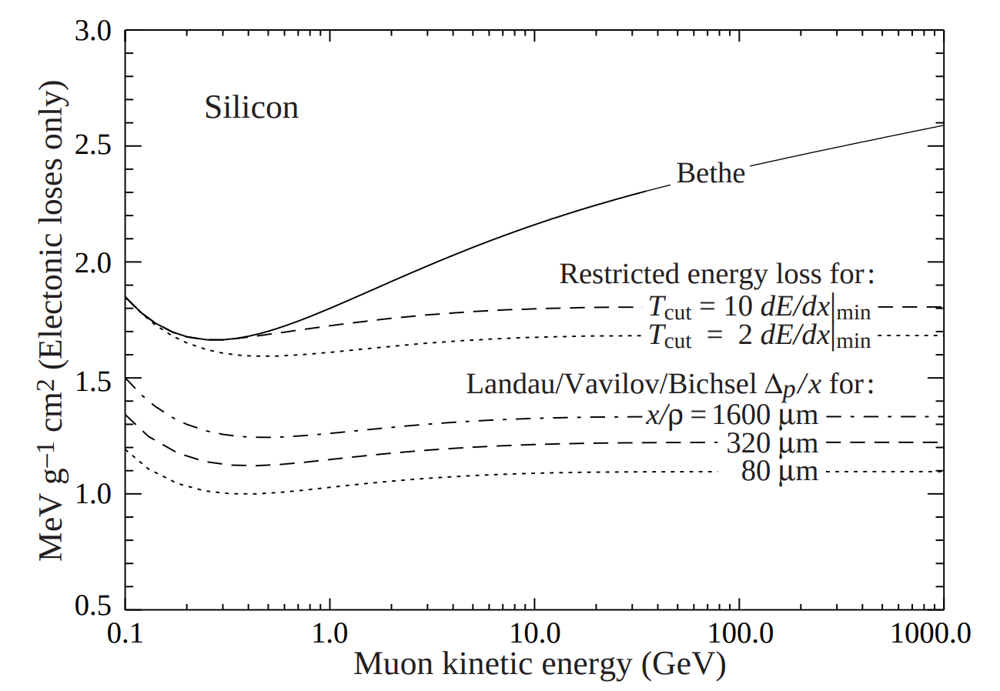
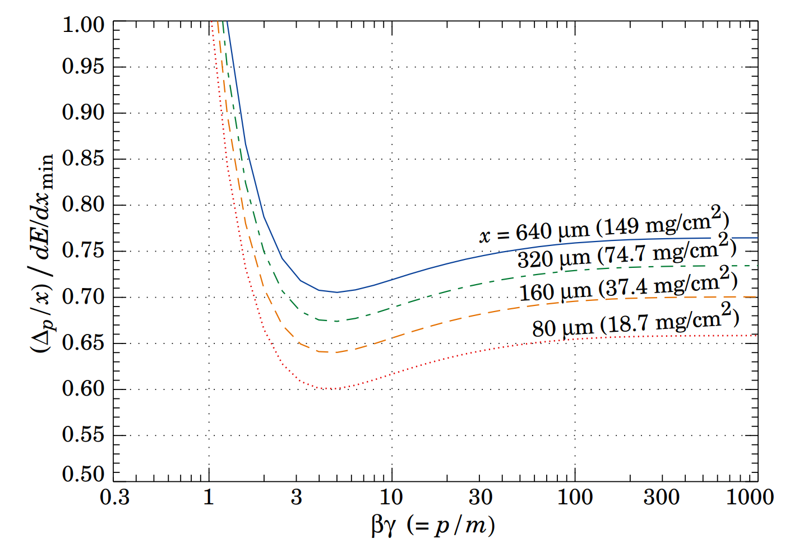

# Procedure {#procedure}

For a more detailed explanation, please read [this
document](https://twiki.cern.ch/twiki/pub/CMS/HGCALSimulationAndPerformance/CalibratedRechits.pdf)
Lots of useful information can also be found at [this
link](https://indico.cern.ch/event/508120/contributions/2028680/attachments/1244672/1832373/HGCal_calibRecHit_16Mar16.pdf#search=arabella%20calibration).

> **[info] Info**
> For further information, especially related to the TDR geometry that is being
delivered in July 2018, refer to [this
talk](https://indico.cern.ch/event/740826/contributions/3058501/attachments/1678687/2696151/CalibratedRecHits.pdf).

The rechits coming out the detector electronics have a magnitude measured in
**femtoCoulomb** (**fC**) corresponding to the energy desposited in the active
thickness of the Si sensor cells. The calibration procedure will start from
those hits and produce **calibrated** rechits that can be used for clustering
purposes (hence energy measurements). There are 3 steps involved in the
calibration procedure:

1. Equalization of the signal scale to account for the three Si sensor
   thicknesses (3 constants)

1. Equalization of the signal scale to account for the differing absorber
   thicknesses in the 52 layers of HGCAL (52 constants)

1. Setting the overall scale such that when the signals in a shower are added,
   their sum is a good estimate of the energy of the incoming particle which
   caused the shower (1 constant)

These steps are detailed below.

## Rescaling to MIPs {#rescaling}

In a sampling calorimeter with varying thicknesses of absorber, the energy
samplings must be reweighted to account for the different absorber thicknesses.
The actual energy deposited in the sensitive detectors is proportional but not
identical to the original energy of the incoming particle.

It is generally agreed that for this purpose the thickness should be measured in
terms of $$dE/dx$$ ($$\textrm{MeV}/(g/\textrm{cm}^3)$$)(i.e. one uses the
integrated energy loss for a MIP in a layer of absorber). This can be considered
as being due to the fact that the dominant energy absorption process in the
shower is ionization.

The first step consists of taking the value in fC coming out of the ADC and
convert it into *average number of MIPs*, where the conversion factor is the
most probable value of the Landau distribution for a MIP in Si, computed for the
3 different sensors thickness.

The following figure, taken from the PDG document linked in the
[reading](#reading) section, helps understanding the situation better:




Currently (june 2018, 22:55:15 (UTC+0200)) the **fCperMIP** values are:

| Si Thickness [$$\mu\textrm{m}$$] | fCperMIP [$$\textrm{fC}$$] |
|:---:|:--:|
|  100 | 1.25 |
|  200 | 2.57 |
|  300 | 3.88 |


## Re-weighting for absorber thickness {#reweighting}

Let's assume now that $$n_i$$ is the **number of equivalent MIPs in the i-th
sensitive(active) layer**. This number is simply:

$$n_i = \frac{A_i}{\textrm{fCperMIP}}$$

where the amplitude $$A_i$$ in the i-th active layer is given by:

$$ \textrm{ADC_counts}\times\textrm{adcLSB} $$

and is expressed in fC. The term $$\textrm{adcLSB}$$ is usually computed
dividing the full range of the input analogue signal (dynamic range) by the
total amount of (signal) bits available. Those numbers are configuration
parameters in release.

We can also safely assume that the average number of MIPs in the i-th
**passive** layer (i.e. in the **i-th absorber**) is the mean between
$$n_{i-1}$$ and $$n_i$$, i.e. the mean between the **preceding active layer
($$i-1$$)** and the **subsequent one ($$i$$)**.

The total energy lost in the i-th passive layer is then:

$$E_i = \frac{n_{i-1} + n_i}{2} \times \lambda_i$$

where

$$ \lambda_i = \left(\frac{dE^{absorber}}{dx}\right)_i$$

The total energy lost in the shower is:

$$\sum_i^{layers} E_i = \sum_i^{layers} \frac{n_{i-1} + n_i}{2} \times
\lambda_i$$

This could be rewritten as (boundary conditions at first and last layer to be
checked and carefully handled):

$$\sum_i^{layers} E_i = \sum_i^{layers} \frac{\lambda_i+\lambda_{i+1}}{2}\times
n_i $$

We measure the terms:

$$\lambda_i = \left(\frac{dE^{absorber}}{dx}\right)_i$$

in MeV, i.e. multiply the $$dE/dx$$ [$$\textrm{Mev}/\textrm{cm}$$] of the absorber material
by its thickness [$$\textrm{cm}$$].


> **[warning] Warning**
> The above calculation works great for orthogonally incident particles, which is
> never the case we face in reality. The assumption we do is that the
> $$\textrm{fCperMIP}$$ value will scale in the same way as the $$\lambda_i$$
> parameter, i.e. with the $$cos(\theta)$$ of the incident angle. This is quite
> true but not exactly correct.


Eventually, all energies are converted into $$\textrm{GeV}$$ to comply with the
official CMS units convention.

## Shower energy scale {#absolute}

The final step is to scale the rechit magnitudes so that their sum approximately
represents the energy deposited by an electromagnetic shower. We choose to make
the sum of all rechits with $$E > 1 \textrm{MIP}$$ equal to the true incident
photon energy.

# Software Implementation {#software}

What has been described in the previous section has been implemented into CMSSW.
There are few steps to run in order to convert the digital signal received from
the electronics (in ADC counts) into a calibrated hit. These are documented in
the following sections.

## Uncalibrated RecHits {#uncalib}

The ```C++``` module responsible for the creation of the un-calibrated rechits
is
[```HGCalUncalibRecHitProducer```](https://github.com/cms-sw/cmssw/blob/master/RecoLocalCalo/HGCalRecProducers/plugins/HGCalUncalibRecHitProducer.cc),
configured with the python label ```HGCalUncalibRecHit```. The main goal of this
module is to convert the input HGCAL Digis, which are measured in ADC count,
into rechits whose amplitude is expressed in terms of average number of MIPs.
The module is also configured so that it can dynamically convert ADC counts into
a real amplitide, measured in $$\textrm{fC}$$, which is then normalised to MIP,
depending on the thickness of the sensor. Internally, all the heavy lifting is
done by a plugin, acting as a worker. The plugin to load is specified in the
configuration itself and is dynamically loaded following the standard procedure
in cmssw. The currently (29 june 2018, 12:09:21 (UTC+0200)) configured
plugin/worker is
[```HGCalUncalibRecHitWorkerWeights```](https://github.com/cms-sw/cmssw/blob/master/RecoLocalCalo/HGCalRecProducers/plugins/HGCalUncalibRecHitWorkerWeights.cc).
Under the hood, one level deeper, the module that is responsible of making this
conversion is
[```HGCalUncalibRecHitRecWeightsAlgo<HGCHEDataFrame>```](https://github.com/cms-sw/cmssw/blob/master/RecoLocalCalo/HGCalRecAlgos/interface/HGCalUncalibRecHitRecWeightsAlgo.h)
via the ```makeRecHit``` method.

> **[info] Info**
> The takeway message is that the product produced by the
```HGCalUncalibRecHitProducer``` is a collection of HGCal un-calibrated rechits
(```edm::SortedCollection<HGCUncalibratedRecHit>```) whose ```amplitude```
method will result in the average number of MIPs corresponding to the measured
signal for that specific Silicon detector.

This implements the [rescale](#rescaling) section.


## Calibrated RecHits {#calib}

The ```C++``` module responsible for the creation of the calibrated rechits is
[```HGCalRecHitProducer```](https://github.com/cms-sw/cmssw/blob/master/RecoLocalCalo/HGCalRecProducers/plugins/HGCalRecHitProducer.cc)
configured with the python label ```HGCalRecHit```. Also in this case, all the
heavy lifting is internally done by an external plugin, loaded using the
canonical cmssw mechanism, and configured via python. The currently
(29 juin 2018, 14:29:44 (UTC+0200)) configured plugin is
[```HGCalRecHitWorkerSimple```](https://github.com/cms-sw/cmssw/blob/master/RecoLocalCalo/HGCalRecProducers/plugins/HGCalRecHitWorkerSimple.cc).
The plugin will loop over all the input collection (EE, FH and BH uncalibrated
rechits, separately), and call the ```run``` method of its own configured
plugin/worker. The worker itself will outsource much of its duties to another
```C++``` object:
[```HGCalRecHitSimpleAlgo```](https://github.com/cms-sw/cmssw/blob/master/RecoLocalCalo/HGCalRecAlgos/interface/HGCalRecHitSimpleAlgo.h).
The main plugin will read the weights for each single layer from the
configuration file and pass them down to its internal `worker`. This will read
each hit, one by one, determine to which layer is belongs to and rescale its
```amplitude``` by the weights, eventually converting it from $$\textrm{MeV}$$
to $$\textrm{GeV}$$. This step is implementing the equation:

$$E_i = \frac{\lambda_i+\lambda_{i+1}}{2}\times n_i$$

where the input weights are, in fact, the factors:

$$\frac{\lambda_i+\lambda_{i+1}}{2}$$

as derived directly from the Geant4 simulation.


## Final Energy Scale {#finalenergy}

Currently the [final calibration energy](#absolute) has been implemented only at
`particleFlow` level, in particular only in the context of `realistic
SimClusters`, which are the truth-based reconstruction of HGCAL that is feed
into Particle Flow. The `C++` module that is responsible of the creation of the
realistic SimClusters and of their validation is `PFClusterProducer` with the
python label `particleFlowClusterHGCal`. The python configuration of the module
contains 2 sets of eta-binned energy corrections, one for `egamma` objects and
one for `hadronic` objects.

> **[warning] Warning**
> At present this distinction is guaranteed by the fact that this step is
derived from Monte Carlo truth information. In the real life either we need to
find a unique set of constants or, better, find a fully reconstruction based way
to distinguish between the 2 types.

Also in this case, most of the heavy lifting is done by an external worker
loaded via the usual cmssw plugin mechanism. This is
[`RealisticSimClusterMapper`](https://github.com/cms-sw/cmssw/blob/master/RecoParticleFlow/PFClusterProducer/plugins/SimMappers/RealisticSimClusterMapper.cc).
The output of this module is a collection of `PFClusters` that will have the
`energy` set to the **uncorrected one**, and the `correctedEnergy` set to the
**corrected** one.

> **[danger] Danger**
> The `PFCluster`s derived from the `MultiClusters` **will not have this final
calibration applied**.


## Configuration files {#config}

* [Uncalibrated RecHits](https://github.com/cms-sw/cmssw/blob/master/RecoLocalCalo/HGCalRecProducers/python/HGCalUncalibRecHit_cfi.py)
* [Calibrated RecHits](https://github.com/cms-sw/cmssw/blob/master/RecoLocalCalo/HGCalRecProducers/python/HGCalRecHit_cfi.py)
* [PFCluster Calibration](https://github.com/cms-sw/cmssw/blob/master/RecoParticleFlow/PFClusterProducer/python/particleFlowRealisticSimClusterHGCCalibrations_cfi.py)


# Useful numbers {#usefulnumbers}

* The density of Silicon is 2.328 $$\textrm{g}/\textrm{cm}^3$$
* The value of $$\frac{\textrm{dE}}{\textrm{dx}}\rvert_{\textrm{min}}$$ is 1.664
$$\textrm{MeV} \textrm{g}^{-1} \textrm{cm}^2$$, i.e., 3.88
$$\textrm{MeV}/\textrm{cm}$$ (i.e. $$388 \textrm{eV}/\mu\textrm{m}$$)
* Energy required to create an e-h in Silicon is $$3.62 \textrm{eV}$$
* Typically, for $$300 \mu\textrm{m}$$ thick Si sensor, a MIP will deposit the
  equivalent of $$73 e^-/\mu\textrm{m}$$
* Hence, for an orthogonally incident MIP particle, we will measure a charge
  deposit of $$73\times300 e^-$$, i.e. $$\sim 22K e^- \Rightarrow \sim 3.5E^{-15}
  \textrm{C} = 3.5 \textrm{fC}$$, to be compared with the quoted value of
  $$3.88$$ listed in the table above.

# Further Reading {#reading}

* PDG: [Passage of particles through matter](http://pdg.lbl.gov/2017/reviews/rpp2017-rev-passage-particles-matter.pdf)
